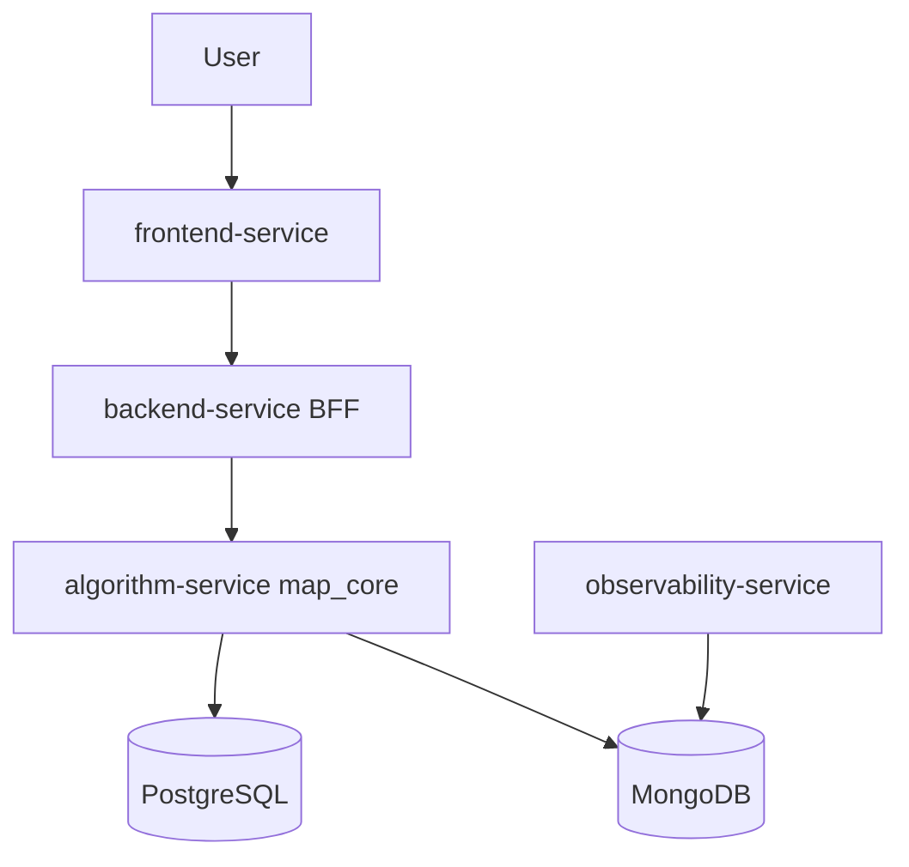
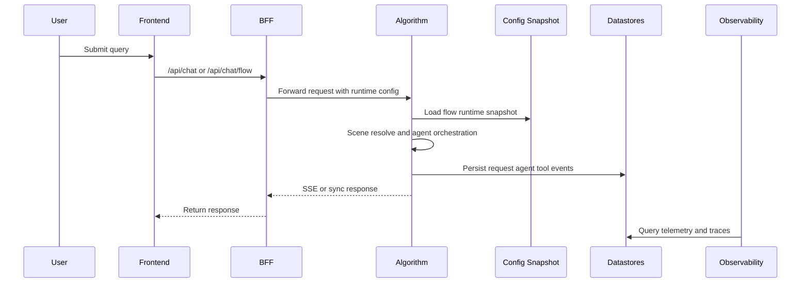

# MAP (Multi Agent Path)

MAP 是一个面向企业场景的多智能体编排平台，采用 `前端 -> BFF -> 算法 -> 观测` 的分层架构，支持全域智能问答与跨业务域心流编排（ScenarioHub + SkillHub）。

## Project Positioning

- 面向业务团队：提供“可配置、可观测、可治理”的企业智能体运行底座。
- 面向工程团队：将 UI、业务编排、算法执行、运行观测彻底解耦，支持独立演进。
- 面向运维治理：通过策略配置、运行时鉴权、链路追踪实现上线可控与问题可回溯。

## Core Capabilities

- 双执行模式：
  - `全域模式`：基于场景识别进行业务智能体调度与总结。
  - `心流模式`：基于 ScenarioHub/SkillHub 构建跨域串行执行图。
- 动态治理：管理端可配置模型、智能体、权限、心流策略，并实时影响新请求。
- 安全执行：工具预挂载 + 运行时二次鉴权，防止越权工具调用。
- 端到端可观测：请求、智能体、工具三层事件入库，支持链路追踪与错误聚类。

## System Architecture



## Runtime Flow

### 1) 全域模式（Global Domain）

1. 前端调用 `POST /api/chat/stream/v2`（经 BFF）。
2. 算法服务进行场景识别并选择业务智能体。
3. 智能体执行工具调用，汇总后按 SSE 输出 `start/meta/content_delta/done/error`。
4. 运行事件写入 Mongo，观测服务可查询请求详情与执行链路。

### 2) 心流模式（Flow Domain）

1. 前端调用 `POST /api/chat/stream/flow/v1`（经 BFF）。
2. 算法服务加载心流策略快照（BFF 管理端配置源）。
3. ScenarioResolver 命中场景后构建执行图，SkillHub 动态挂载可用工具。
4. 节点按依赖顺序执行，并输出策略命中、节点结果、repair 事件。
5. 未命中场景或策略允许时，自动回退全域链路保证可用性。

## End-to-End Sequence



## Repository Layout

```text
MAP/
├── README.md
├── docker-compose.yml
├── SPEC/
│   ├── ARCHITECTURE.md
│   ├── STANDARDS.md
│   └── README.md
├── map-business-frontend/                # 业务前端（React + Vite）
├── map-business-backend/                 # 业务后端 BFF（FastAPI）
├── map_core/                             # 算法服务（FastAPI）
├── map-observability/                    # 观测系统（前后端）
└── packages/
    └── map-tree-core/                    # 问答树共享能力
```

## Quick Start

### 1) Prerequisites

- Docker + Docker Compose v2
- 建议 8GB+ 可用内存

### 2) Prepare Environment

```bash
cp .env.example .env
```

最少建议配置：

- `MAP_LLM_BASE_URL`（例如 `https://api.deepseek.com`）
- `MAP_LLM_MODEL`（例如 `deepseek-v4-flash`）
- `MAP_LLM_API_KEY`

### 3) Start All Services

```bash
docker compose up -d --build
```

### 4) Access URLs

- 业务前端：`http://localhost:5174`
- BFF：`http://localhost:18080`
- 算法服务：`http://localhost:10000`
- 观测前端：`http://localhost:15152`
- 观测后端：`http://localhost:15151/api/v1`

### 5) Health Check

```bash
curl http://localhost:18080/health
curl http://localhost:10000/health
curl http://localhost:15151/api/v1/health
```

### 6) Stop / Cleanup

```bash
docker compose down
docker compose down -v
```

## API Entry Points

- 全域问答：`POST /api/chat`、`POST /api/chat/stream/v2`
- 心流问答：`POST /api/chat/flow/v1`、`POST /api/chat/stream/flow/v1`
- 管理配置：`/api/admin/*`
- 观测分析：`/api/v1/overview`、`/api/v1/requests`、`/api/v1/correlation/*`

## Configuration & Governance

- 管理态配置存储于 BFF 状态文件：`map-business-backend/app/data/admin_state.json`。
- 算法服务通过 `flow-runtime-snapshot` 拉取心流策略并做本地缓存。
- 心流策略命中会在响应 `meta` 与事件流中输出，便于前端与观测侧定位。

## Observability & Troubleshooting

- 观测系统基于 Mongo 中的 `request_records`、`agent_executions`、`tool_call_records` 分析链路。
- 若请求卡住，优先检查：
  - `backend-service` 与 `algorithm-service` 健康状态。
  - `MAP_LLM_API_KEY` 与模型配置是否有效。
  - 观测接口 `GET /api/v1/requests` 的 `status` 与 `error` 字段。

## Security Notice

- 不要将真实密钥提交到仓库（`.env` 应保持本地私有）。
- 算法服务请求日志默认对 `api_key/token/authorization` 做脱敏。
- 生产环境建议限制 CORS 来源并接入企业鉴权网关。

## Documentation Index

- 总体架构：[SPEC/ARCHITECTURE.md](SPEC/ARCHITECTURE.md)
- 工程规范：[SPEC/STANDARDS.md](SPEC/STANDARDS.md)
- 文档总览：[SPEC/README.md](SPEC/README.md)
- 算法服务：[map_core/README.md](map_core/README.md)
- BFF 服务：[map-business-backend/README.md](map-business-backend/README.md)
- 前端服务：[map-business-frontend/README.md](map-business-frontend/README.md)
- 观测系统：[map-observability/README.md](map-observability/README.md)

## Acknowledgement

本 README 的组织方式参考了多智能体系统项目的最佳实践（例如 [bytedance/deer-flow](https://github.com/bytedance/deer-flow)），并结合 MAP 当前代码实现进行了工程化落地。
