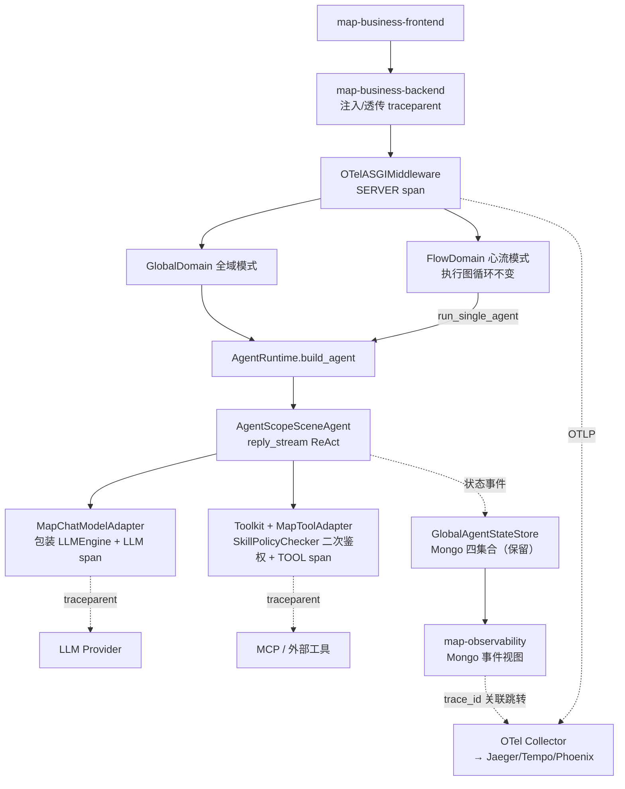

# MAP 基于 AgentScope 2.0 的引擎改造与 OpenTelemetry 可观测性建设 —— 评估与改造计划

> 版本：v1.0（2026-08-07）
> 参考实现：`/Users/liusongnan/hgt-2`（分支 `qoder/dev-lsn`，AgentScope `2.0.4` + OTel 已落地验证）
> 改造对象：`/Users/liusongnan/MAP`（重点为 `map_core`，联动 `map-observability`）

---

## 1. 背景与目标

MAP 是从 hgt 系列项目签出演化而来的多智能体编排平台。当前 `map_core` 采用**完全自研的 ReAct 循环**（`ToolCallAgent`）与**自研 Mongo 事件体系**（`GlobalAgentStateStore`）。而同源的 `hgt-2` 分支已完成两项关键升级并可作为算法引擎参考：

1. **AgentScope 2.0.4 接管 Agent 内核**：通过适配器模式（`HGTChatModelAdapter` / `HGTToolAdapter` / `AgentScopeSceneAgent`）将自研 ReAct 循环替换为 AgentScope `Agent.reply_stream()`，同时保持对外 HTTP/SSE 契约不变。
2. **OpenTelemetry 全链路可观测**：`hgt2/observability/` 提供 TracerProvider、OTLP（grpc/http）Exporter、ASGI Server Span、工具/上下文压缩 Span、日志转 Span Event、W3C Trace Context 跨服务传播，与原有 Mongo 事件体系**并存**而非替代。

本计划的目标：

- **G1**：将 `map_core` 的 Agent 执行内核迁移到 AgentScope 2.0.4，复用 hgt-2 已验证的适配层，保持 `/global_domain/*`、`/flow_domain/*`、`/master_pipeline/*` 及 SSE 事件契约 100% 兼容。
- **G2**：为 MAP 全链路（BFF → map_core → 工具/LLM → 观测系统）引入 OpenTelemetry，实现标准化 Trace/Span/Log，并使 `map-observability` 可同时消费 Mongo 事件与 OTel 数据。
- **G3**：迁移过程可灰度、可回滚，任何阶段均不破坏管理端动态治理（AdminState 快照）与心流模式（ScenarioHub/SkillHub）能力。

---

## 2. 现状分析

### 2.1 MAP `map_core` 现状（改造对象）

| 维度 | 现状 | 关键文件（行数） |
| --- | --- | --- |
| Agent 内核 | 自研 ReAct 循环：构建消息 → 循环 max_steps → LLM 调用 → 工具执行 → 终止判断 | `service/agent/tool_call_agent.py`（579 行） |
| Agent 运行时 | `AgentRuntime` + `AgentExecutionSpec` + `AgentDispatcher` 并发调度 | `service/agent_runtime.py`（486 行） |
| LLM 调用 | 自研 `LLMEngine`（OpenAI 兼容，asimple_chat/achat/ask_tool 等） | `utils/llm_engine.py`（1698 行） |
| 双执行模式 | 全域模式（`global_domain.py`）+ 心流模式（`flow_domain.py`，执行图循环/修复/回退） | `service/flow_domain.py`（869 行） |
| 工具体系 | `ToolRegistry` 静态注册 + `DynamicTools`（MCP / Prompt Skill）+ `SkillPolicyChecker` 二次鉴权 | `service/dynamic_tools.py` 等 |
| 事件体系 | `GlobalAgentStateStore`：有界队列（500）+ 3 worker 异步落 Mongo 四集合（agent_executions / tool_call_records / request_records / llm_call_records） | `service/state_store.py`（837 行） |
| 可观测性 | 无 OTel 依赖；`map-observability` 后端拉模式聚合 Mongo 事件 + 可选 Loki 日志正则回溯 | `pyproject.toml` 无 opentelemetry |
| Python | `>=3.12` | `map_core/pyproject.toml` |

### 2.2 现有可观测性的局限（来自 repowiki 与观测服务实现）

1. **拉模式、实时性有限**：观测后端轮询 Mongo 聚合，无流式推送。
2. **日志解析脆弱**：从 Loguru 文本正则提取字段，格式变化即失效。
3. **无跨服务链路标准**：仅靠 `X-Request-ID` 手工透传，BFF → map_core → 外部工具/LLM 无 W3C Trace Context，无法接入 Jaeger/Tempo/Phoenix 等标准后端。
4. **事件可靠性弱**：有界队列满即丢弃；无去重/幂等。
5. **无指标（Metrics）体系**：QPS、P95 延迟、token 成本等只能事后从 Mongo 聚合。

### 2.3 hgt-2 参考实现要点（可直接复用的资产）

| 资产 | 位置（hgt-2） | 说明 |
| --- | --- | --- |
| 模型适配器 | `hgt2/service/agentscope2/model.py` | `HGTChatModelAdapter` 继承 `ChatModelBase`，包装 `LLMEngine.ask_tool()`；处理 terminate tool 拦截、首轮 force_tool_call→`tool_choice=required`、response_handler 审计、消息块转换（Text/Thinking/ToolCall Block）、usage 映射 |
| 场景代理 | `hgt2/service/agentscope2/agent.py` | `AgentScopeSceneAgent` 继承 `TraceableAgent`，用 `Agent.reply_stream()` 驱动 ReAct；消费 `ModelCallStart/End`、`ThinkingBlockDelta`、`ToolCallStart`、`ToolResultTextDelta`、`ExceedMaxIters` 等事件并转译为 HGT SSE 契约；含 `_StepSystemPromptMiddleware`、`ToolCallExitHandler` |
| 工具适配器 | `hgt2/service/agentscope2/tool.py` | `HGTToolAdapter` 继承 `ToolBase`，将业务 Tool 挂入 `Toolkit`；`is_concurrency_safe=True`；内置 OTel TOOL span |
| 模型工厂 | `hgt2/service/agentscope2/model_factory.py` | `build_chat_model` / `invoke_tools` / `generate_structured`（json_object 与 json_schema）/ `stream_events`；出站请求注入 traceparent |
| 上下文管理 | `hgt2/service/agentscope2/offloader.py` 等 | 真实上下文窗口、自动压缩、Tool Result Offload |
| OTel 初始化 | `hgt2/observability/telemetry.py` | TracerProvider + BatchSpanProcessor；OTLP grpc/http 双协议；LoggerProvider 或"日志转 Span Event"两种模式；敏感字段脱敏；Resource 含 `openinference.project.name`（兼容 Phoenix） |
| ASGI 中间件 | `hgt2/observability/asgi.py` | SERVER span、traceparent 提取、异常记录、5xx 置 ERROR |
| 事件与 OTel 并存 | `hgt2/service/state_store.py` | Mongo 事件体系保留，OTel 叠加；两套体系通过 request_id/session_id 关联 |
| 迁移经验文档 | `docs/HGT_2_IMPLEMENTATION_PROGRESS.md`、`docs/AGENTSCOPE_2_API.md` | 版本决策（锁定 2.0.4）、兼容边界、实施矩阵、生产化缺口 |

---

## 3. 可行性评估

### 3.1 AgentScope 2.0 改造可行性：**高（推荐执行）**

**支撑依据**

1. **同源验证**：hgt-2 与 map_core 代码同源（`scene_registry`、`global_domain`、`agent_dispatcher`、`state_store` 结构高度一致），hgt-2 已用适配器模式完成迁移并保持 SSE 契约兼容，等于已为 MAP 做过一次"预演"。
2. **适配器模式解耦**：AgentScope 只接管 ReAct 内核（循环控制、消息块、Toolkit、上下文），LLMEngine、工具治理（预挂载 + `SkillPolicyChecker` 二次鉴权）、事件体系全部保留在 MAP 侧，业务代码框架无关。
3. **契约映射完整**：MAP `ToolCallAgent` 的关键行为在 AgentScope 中均有对应物——
   - `max_steps` → `ReActConfig` 迭代上限 + `ExceedMaxItersEvent`
   - `force_tool_call` → 首轮 `tool_choice=required`（HGTChatModelAdapter 已实现）
   - terminate 工具 → `ToolCallExitHandler` 拦截
   - 流式 content/reasoning → `TextBlock`/`ThinkingBlock` delta 事件
   - Token 统计 → `ModelCallEndEvent` usage 映射
4. **收益明确**：免费获得 AgentScope 的上下文自动压缩、Tool Result Offload、并发工具执行、Hook/Middleware 体系、内置 tracing 埋点位，替代 4400+ 行自研内核的长期维护成本。

**风险与关注点**

| 风险 | 等级 | 说明与对策 |
| --- | --- | --- |
| Python 版本 | 低 | hgt-2 用 `>=3.13`，map_core 为 `>=3.12`；AgentScope 2.0.4 支持 3.10+。建议 map_core 同步升到 3.13 与 hgt-2 对齐（uv 管理，成本低），或先在 3.12 上验证。 |
| 心流模式无参考实现 | **中** | hgt-2 无 `flow_domain`/`scenario_hub`/`skill_hub`（被 Capability Gateway 抽象替代）。心流模式的执行图循环调用 `run_single_agent`，需自行将节点执行切换到 `AgentScopeSceneAgent`；好在心流的图循环/verdict/修复逻辑在 Agent 之上，Agent 内核替换对其透明。 |
| SSE 事件顺序回归 | 中 | 前端 `RequestCallTree` 与 BFF 依赖事件顺序。必须建立黄金轨迹（golden trace）回归集，逐事件比对新旧实现输出。 |
| 版本锁定 | 低 | 锁定 `agentscope==2.0.4`（与 hgt-2 一致）；升级需重新核对 `Agent`/`ChatModelBase`/`ToolBase`/`Message`/`Event` 契约。 |
| 中断恢复/会话记忆 | 中 | MAP `ToolCallAgent` 支持中断恢复与跨轮记忆；需验证 AgentScope Memory 与 MAP 的 `agent_memory_store` 的桥接（hgt-2 用独立 ReMe Adapter，MAP 可先保留自有 memory store 注入 history）。 |
| 二次鉴权时序 | 低 | `SkillPolicyChecker` 必须在 `HGTToolAdapter.execute` 内、真实工具调用前执行，保持"预挂载 + 运行时校验"两阶段语义不变。 |

### 3.2 OpenTelemetry 可观测性可行性：**高（几乎零风险）**

1. `hgt2/observability/` 两个文件（telemetry.py + asgi.py）不依赖 AgentScope，可**独立先行移植**到 map_core，与 Agent 内核改造解耦。
2. 采用"**OTel 叠加、Mongo 事件保留**"策略（hgt-2 已验证）：现有 `map-observability` 完全不受影响；OTel 数据发往标准后端（Jaeger/Tempo/Phoenix/Grafana），观测前端后续再逐步整合。
3. 跨服务传播路径清晰：BFF（转发时注入/透传 traceparent）→ map_core ASGI 中间件（提取并创建 SERVER span）→ 工具 span / LLM 出站注入 traceparent → MCP/外部服务。
4. 开关式启用（`MAP_OTEL_ENABLED` + `OTEL_EXPORTER_OTLP_*`），未配置时零开销，天然可回滚。
5. 直接缓解 2.2 节局限 #1/#3/#5：标准协议替代轮询关联、W3C 上下文替代手工透传、后续可加 OTel Metrics。

**结论：两项改造均可行。推荐执行顺序为"OTel 先行（低风险、独立收益）→ AgentScope 内核替换（灰度）→ 观测系统整合"。**

---

## 4. 目标架构与模块映射

### 4.1 目标架构

### 4.2 模块映射表（hgt-2 → map_core）

| hgt-2 源 | map_core 目标 | 改造方式 |
| --- | --- | --- |
| `hgt2/service/agentscope2/model.py` | `map_core/service/agentscope2/model.py` | 移植，`app_config`/import 路径替换，前缀 `HGT`→`Map`（或保留，统一即可） |
| `hgt2/service/agentscope2/tool.py` | `map_core/service/agentscope2/tool.py` | 移植 + 在 `execute` 中前置调用 `SkillPolicyChecker`（MAP 特有） |
| `hgt2/service/agentscope2/agent.py` | `map_core/service/agentscope2/agent.py` | 移植 + 对齐 MAP 的 SSE 事件名与 `TraceableAgent` 事件类型（含 flow_* 事件） |
| `hgt2/service/agentscope2/model_factory.py` | `map_core/service/agentscope2/model_factory.py` | 移植，接 MAP 的 LLMClientPool/模型配置中心（AdminState 模型中心） |
| `hgt2/service/agentscope2/offloader.py` | `map_core/service/agentscope2/offloader.py` | 移植（上下文压缩与 MAP `context_compressor` 二选一，建议采用 AgentScope 侧） |
| `hgt2/observability/telemetry.py` | `map_core/observability/telemetry.py` | 移植，环境变量前缀 `HGT_OTEL_*`→`MAP_OTEL_*`，接 MAP 多环境配置体系 |
| `hgt2/observability/asgi.py` | `map_core/observability/asgi.py` | 移植，挂在 `RequestContextMiddleware` 之外层，X-Request-ID 写入 span 属性 |
| `hgt2/service/agent_runtime.py` 的 build_agent | `map_core/service/agent_runtime.py` | 增加 `engine=agentscope|legacy` 分支（灰度开关） |
| — | `map-business-backend/app/core_client.py` | 新增：转发时注入 traceparent（`opentelemetry.propagate.inject` 或手工透传 header） |
| — | `map-observability-backend` | 新增：事件详情页展示 trace_id 并支持跳转外部 Trace UI |

**明确不改**：`flow_domain.py` 图循环/修复/回退逻辑、`scenario_hub`/`skill_hub`/`hyperedge_planner`、BFF AdminState 治理、SSE 对外契约、Mongo 事件 schema、前端两个控制台。

---

## 5. 分阶段实施计划

### Phase 0：基线与护栏（0.5~1 周）

| # | 任务 | 验收标准 |
| --- | --- | --- |
| 0.1 | 建立黄金轨迹回归集：选取全域模式（含工具调用/多 Agent/流式）与心流模式（含修复/回退）各 5+ 条真实请求，录制完整 SSE 事件序列与 Mongo 事件落库结果 | 回归脚本可自动比对事件类型、顺序、关键字段 |
| 0.2 | map_core 升级 Python `>=3.13`、引入依赖：`agentscope==2.0.4`、`opentelemetry-{api,sdk,exporter-otlp-proto-grpc,exporter-otlp-proto-http}>=1.44.0,<2` | `uv sync` 通过，现有 pytest 全绿 |
| 0.3 | 通读 hgt-2 `docs/AGENTSCOPE_2_API.md` 兼容边界，确认 MAP 用到的每个行为有对应实现 | 输出契约核对清单（checklist） |

### Phase 1：OpenTelemetry 先行接入（1 周，独立发布）

| # | 任务 | 验收标准 |
| --- | --- | --- |
| 1.1 | 移植 `observability/telemetry.py` + `asgi.py` 到 map_core；配置项进 `config/common.py` 与 `.env.example`（`MAP_OTEL_ENABLED`、`OTEL_EXPORTER_OTLP_ENDPOINT`、协议、采样率、`logs_as_span_events`） | 未配置时行为与现状完全一致（零开销） |
| 1.2 | docker-compose 增加可选 OTel Collector + Jaeger（或 Phoenix）profile | `docker compose --profile otel up` 可见 map_core SERVER span |
| 1.3 | LLMEngine 出站调用注入 traceparent；`ToolExecutor` 现有（legacy）路径包 TOOL span；`state_store` 记录事件时写入当前 trace_id/span_id 字段（新增字段，向后兼容） | 一次请求在 Jaeger 中呈现 HTTP→LLM→Tool 完整树；Mongo 事件含 trace_id |
| 1.4 | BFF `core_client` 转发注入/透传 traceparent | BFF 与 map_core span 同 trace 关联 |
| 1.5 | 日志脱敏清单对齐 hgt-2（authorization/api_key/password/secret/token） | 抽样 span/日志无敏感值 |

### Phase 2：AgentScope 适配层移植与双引擎并行（2~3 周）

| # | 任务 | 验收标准 |
| --- | --- | --- |
| 2.1 | 移植 `agentscope2/` 五个模块（model / tool / agent / model_factory / offloader），完成 import 与配置对接 | 单元测试覆盖：消息块转换、force_tool_call、terminate 拦截、usage 映射 |
| 2.2 | `MapToolAdapter` 接入 `SkillPolicyChecker`（执行前校验）与 `attachment_collector`/`tool_extra_result` 收集器 | 未授权工具调用被拒且事件落库；附件/结构化结果收集与 legacy 一致 |
| 2.3 | `AgentScopeSceneAgent` 事件转译对齐 MAP SSE 契约与 `TraceableAgent` 状态事件（record_thought/tool_call/tool_result/message） | 黄金轨迹逐事件比对通过 |
| 2.4 | `AgentRuntime.build_agent` 增加引擎开关：请求级 `dispatch_config.engine` > AdminState 全局配置 > 环境变量默认 `legacy` | 同一请求可分别用两引擎执行并输出一致契约 |
| 2.5 | 会话记忆桥接：`agent_memory_store` 历史注入 AgentScope 消息序列；中断恢复路径回归 | 多轮对话与中断恢复用例通过 |
| 2.6 | MCP 工具（sse/streamable_http/stdio）与 Prompt Skill 经 `DynamicTools` → `MapToolAdapter` 挂载链路验证 | 动态工具在新引擎下可用 |

### Phase 3：心流模式切换与灰度（1~2 周）

| # | 任务 | 验收标准 |
| --- | --- | --- |
| 3.1 | `flow_domain.run_single_agent` 走 `AgentRuntime` 引擎开关（节点级不感知内核差异）；flow_* 事件（flow_node_started/result/repair_applied）保持不变 | 心流黄金轨迹（含 repair、fallback_to_global）通过 |
| 3.2 | 心流节点 span 建模：每个图节点一个 CHAIN span，父子关系体现执行图拓扑；verdict/repair 记为 span event | Trace UI 可直观看到执行图结构 |
| 3.3 | 灰度发布：dev 环境默认 `agentscope`，AdminState 支持按 agent_code / 按请求比例灰度；观测两引擎的错误率、P95、token 用量对比看板 | 灰度期间可一键回退 legacy |
| 3.4 | 压测对比：并发 20/50 下新旧引擎延迟、内存（AgentScope 上下文压缩收益验证） | 新引擎无显著回退（P95 劣化 <10%） |

### Phase 4：收尾与观测整合（1~2 周）

| # | 任务 | 验收标准 |
| --- | --- | --- |
| 4.1 | 全环境默认引擎切换为 `agentscope`；`ToolCallAgent` legacy 路径标记 deprecated（保留一个版本周期后删除） | 生产（prod 配置）稳定运行 ≥2 周 |
| 4.2 | `map-observability` 整合：事件详情展示 trace_id、一键跳转 Trace UI；Friday 诊断输入拼接 OTel span 摘要 | 排障动线从"翻 Mongo"升级为"事件 ↔ Trace 互跳" |
| 4.3 | OTel Metrics 初步接入（请求量、错误率、token 用量、工具耗时直方图） | Grafana 基础看板 |
| 4.4 | 文档：更新 SPEC/ARCHITECTURE.md、README、`.env.example`；沉淀《AgentScope 引擎运维手册》（版本升级核对清单沿用 hgt-2 文档） | 评审通过 |

**总工期估算：6~9 周（1~2 人力）。关键路径：Phase 2 的事件转译对齐（2.3）。**

---

## 6. 兼容性与回滚策略

1. **双引擎开关**是整个改造的安全带：`engine=legacy|agentscope` 三级配置（请求级 > AdminState > 环境默认），任何阶段问题可即时回退，无需回滚代码。
2. **对外契约冻结**：HTTP 路由、请求/响应 schema、SSE 事件类型与顺序、Mongo 四集合 schema 在整个改造期冻结；新增字段（如 trace_id）只增不改。
3. **OTel 无侵入**：未配置 endpoint 即完全关闭；BatchSpanProcessor 队列满丢弃不阻塞主流程。
4. **数据兼容**：Mongo 事件为观测系统唯一事实源的地位在 Phase 4 之前不变；OTel 仅为增量视图。
5. **版本锁定**：`agentscope==2.0.4` 与 OTel `<2` 上限锁定，升级走独立评审（核对 hgt-2 `AGENTSCOPE_2_API.md` 契约清单）。

## 7. 风险清单（Top 5）

| 风险 | 概率 | 影响 | 缓解 |
| --- | --- | --- | --- |
| SSE 事件顺序/字段与前端调用树不兼容 | 中 | 高 | Phase 0 黄金轨迹逐事件比对；灰度先行 |
| 心流修复/回退路径在新引擎下行为漂移 | 中 | 高 | 心流专项回归（3.1）；节点级引擎开关 |
| AgentScope 上下文压缩改变提示词语义导致效果回退 | 中 | 中 | 压缩开关可关闭；离线效果对比评测 |
| 双引擎并行期维护成本 | 高 | 低 | 严格限定并行期（Phase 2~4，约 6 周），到期删除 legacy |
| OTel 采样/导出在高并发下的性能开销 | 低 | 中 | 头部采样率可配；压测验证（3.4） |

---

## 8. 任务总览（可直接建卡）

- [ ] P0-1 黄金轨迹回归集与自动比对脚本
- [ ] P0-2 Python 3.13 + agentscope/otel 依赖引入
- [ ] P0-3 AgentScope 契约核对清单
- [ ] P1-1 telemetry.py / asgi.py 移植与配置化
- [ ] P1-2 compose 增加 OTel Collector + Jaeger profile
- [ ] P1-3 LLM/Tool span + Mongo 事件写 trace_id
- [ ] P1-4 BFF traceparent 透传
- [ ] P1-5 脱敏清单对齐
- [ ] P2-1 agentscope2 五模块移植 + 单测
- [ ] P2-2 ToolAdapter 接二次鉴权与收集器
- [ ] P2-3 SSE/状态事件转译对齐（关键路径）
- [ ] P2-4 双引擎开关（请求级/AdminState/环境）
- [ ] P2-5 会话记忆与中断恢复桥接
- [ ] P2-6 MCP/Prompt Skill 动态工具验证
- [ ] P3-1 心流节点切换新引擎 + 专项回归
- [ ] P3-2 执行图 span 建模
- [ ] P3-3 灰度机制与对比看板
- [ ] P3-4 压测对比
- [ ] P4-1 默认引擎切换 + legacy 退役计划
- [ ] P4-2 观测系统 trace_id 整合与 Friday 增强
- [ ] P4-3 OTel Metrics 与 Grafana 看板
- [ ] P4-4 架构文档与运维手册更新
