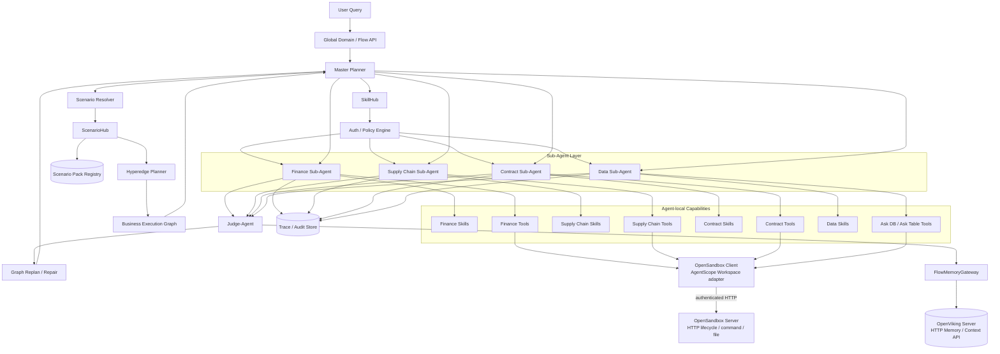
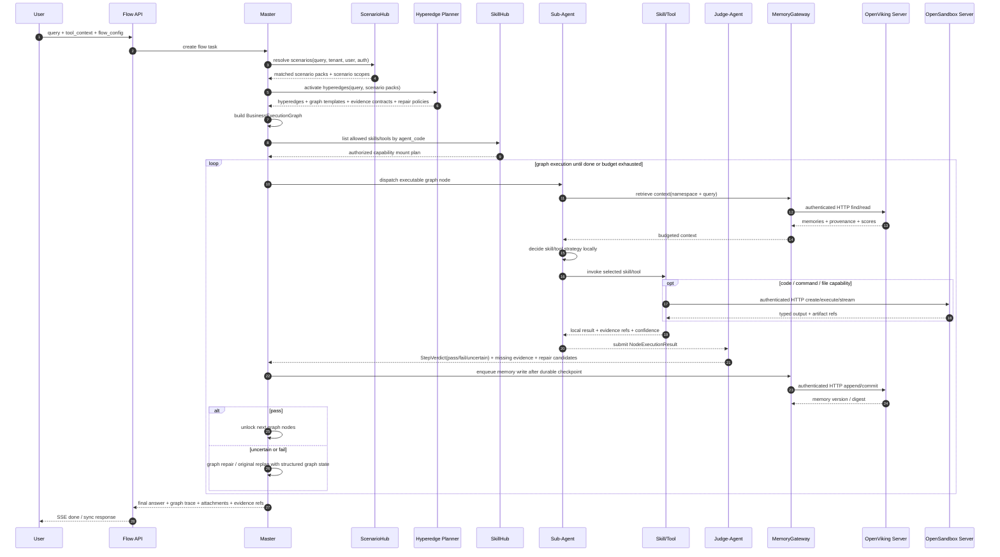
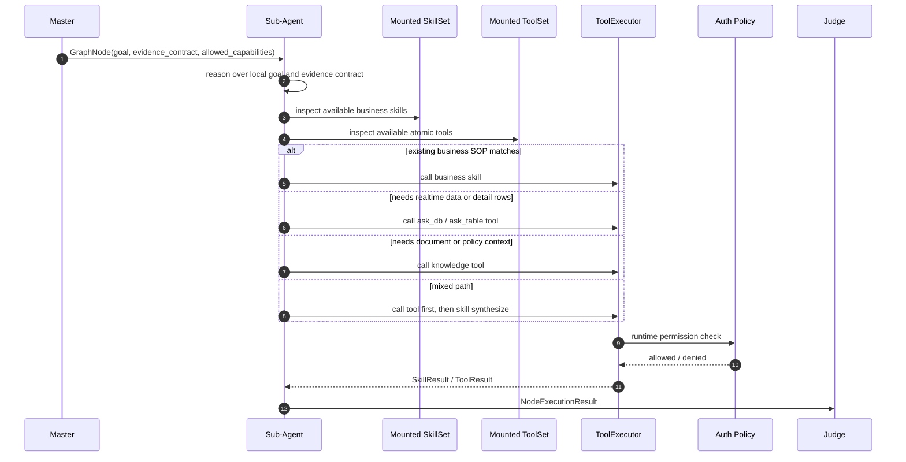

# HGT 2.0 心流模式 ScenarioHub + SkillHub 技术方案

## 1. 方案结论

HGT 2.0 心流模式建议保持现有大框架不变：

`Master -> Sub-Agent -> Skill/Tool -> Judge -> Replan`

在此基础上新增两个可扩展能力层：

- `ScenarioHub`：管理复杂业务场景包，用于让 Master 在规划阶段感知业务 hyperedge、预期执行图、证据契约和修正路径。
- `SkillHub`：管理可执行能力，用于给不同 Sub-Agent 挂载有权限的业务 Skill、问数、问表、知识库、外部工具等。

核心原则：

- 普通局部能力挂在 Sub-Agent 下，由 Sub-Agent 自主选择 Skill 或 Tool。
- 跨多个 Sub-Agent 的复杂业务场景不挂在某个 Sub-Agent 下，而是以 `Scenario Pack` 的形式被 Master 在规划阶段激活。
- POD 不是架构专有模块，只是第一个 `Scenario Pack` 示例，例如 `order_revenue_confirmation`。
- 原有 replan 逻辑保留，但 replan 输入从自然语言失败原因升级为 `BusinessExecutionGraph + StepVerdict + RepairCandidates`。
- 代码/命令/文件执行固定通过独立 OpenSandbox Server 的 HTTP API 请求；算法进程不内建沙箱 runtime，不存在宿主 fallback。
- 记忆/上下文检索固定通过独立 OpenViking Server 的 HTTP API 请求；PG 对话/Run 是业务真相，OpenViking 仅作可检索上下文与长期记忆服务。

---

## 2. 目标与非目标

### 2.1 目标

- 支持未来多个类似 POD 的复杂业务场景，而不是为单一场景定制。
- 让 Master 在任务入口阶段就能感知业务 hyperedge，生成跨 Sub-Agent 的执行图。
- 让 Sub-Agent 保持局部执行自治，在自己的领域内选择 Skill、问数、问表或其他 Tool。
- 保持现有全域主链路和 replan 思路稳定，降低改造风险。
- 实现 Skill 和 Scenario 的权限、版本、审计、灰度与生命周期治理。

### 2.2 非目标

- 不把 Master 改造成直接执行业务 Skill 的万能 Agent。
- 不把所有 Skill 暴露给所有 Sub-Agent。
- 不把 POD 写成架构核心概念。
- 不要求首版实现完整自进化 Skill，只保留经验沉淀与候选生成接口。

---

## 3. 核心概念

### 3.1 ScenarioHub

`ScenarioHub` 管的是“业务流程知识”，回答的是：

> 这类复杂业务问题应该怎么规划、需要哪些证据、可能经过哪些 Agent、失败时如何修正路径？

它管理：

- `Scenario Pack`
- `Business Hyperedge`
- `Execution Graph Template`
- `Evidence Contract`
- `Repair Policy`
- `Required Agents`
- `Required Skill/Tool Hints`
- `Scenario-level Auth Scope`

### 3.2 SkillHub

`SkillHub` 管的是“可执行能力”，回答的是：

> 当前用户、租户、Agent 可以调用哪些能力？这些能力如何执行、如何鉴权、如何审计？

它管理：

- `Skill Descriptor`
- `Tool Descriptor`
- `Agent Mount Policy`
- `Auth Scope`
- `Executor Type`
- `Version`
- `Audit Policy`
- `Input/Output Schema`

### 3.3 Scenario Pack

`Scenario Pack` 是复杂业务场景的可配置包。POD 可以作为其中一个包。

示例：

```json
{
  "scenario_id": "order_revenue_confirmation",
  "display_name": "订单确认收入",
  "domain": "finance_supply_chain",
  "trigger_intents": ["订单确认收入", "收入确认", "发货后能否确认收入"],
  "required_agents": [
    "finance_agent",
    "supply_chain_agent",
    "contract_agent",
    "data_agent"
  ],
  "auth_scopes": ["scenario:order_revenue_confirmation:read"],
  "hyperedges": [],
  "execution_graph_templates": [],
  "evidence_contracts": [],
  "repair_policies": []
}
```

### 3.4 Business Hyperedge

`Business Hyperedge` 表达跨实体、跨系统、跨 Agent 的高阶业务关系。

它不等价于普通 Skill。它更像 Master 规划时的业务图谱和执行协议。

典型字段：

```json
{
  "hyperedge_id": "revenue_confirmable_after_delivery",
  "scenario_id": "order_revenue_confirmation",
  "title": "发货后收入确认条件",
  "description": "判断订单是否满足收入确认条件",
  "participants": [
    "order",
    "contract",
    "delivery_record",
    "invoice",
    "customer_acceptance"
  ],
  "candidate_agents": [
    "finance_agent",
    "supply_chain_agent",
    "contract_agent",
    "data_agent"
  ],
  "evidence_contract": [],
  "repair_policy_refs": []
}
```

### 3.5 Business Execution Graph

`BusinessExecutionGraph` 是 Master 为当前用户问题生成的执行图。

它包含：

- 节点：由哪个 Sub-Agent 执行、目标是什么、需要什么证据。
- 边：依赖关系、条件分支、失败分支。
- 状态：pending、running、passed、failed、uncertain、skipped。
- 修正候选：当前节点失败或证据不足时下一步怎么补。

---

## 4. 总体架构图



部署和调用约束：

- OpenSandbox 与 OpenViking 都是算法链路外的独立 Server；Master/Sub-Agent 只经 MAP client adapter 发起异步 HTTP 请求，不直接读写两个服务的底层存储/运行时。
- OpenSandbox 请求绑定 `workspace_id/run_id/step_id/attempt_id/invocation_id`；OpenViking 将 `workspace_id` 映射为 account、principal 映射为 user，并保留 agent/thread/run provenance。
- 两个 client 统一执行 service auth、timeout、有界 retry、circuit breaker、trace propagation 和 typed errors。OpenSandbox 不可用时 fail-closed/paused；OpenViking retrieve 不可用时只能显式 paused 或 `memory_degraded=true`，不得静默切到本地/Mongo provider。

---

## 5. 用户 Query 时序图



---

## 6. Sub-Agent 内部决策时序图



---

## 7. 数据模型设计

### 7.1 ScenarioPack

```json
{
  "scenario_id": "order_revenue_confirmation",
  "display_name": "订单确认收入",
  "version": "1.0.0",
  "domain": "finance_supply_chain",
  "description": "用于判断订单是否满足收入确认条件",
  "trigger_intents": [],
  "trigger_examples": [],
  "required_agents": [],
  "optional_agents": [],
  "hyperedge_refs": [],
  "execution_graph_template_refs": [],
  "evidence_contract_refs": [],
  "repair_policy_refs": [],
  "auth_scopes": [],
  "status": "active"
}
```

### 7.2 SkillDescriptor

```json
{
  "skill_id": "finance.revenue_rule_check.v1",
  "name": "revenue_rule_check",
  "display_name": "收入确认规则校验",
  "version": "1.0.0",
  "description": "根据收入准则和合同条件校验订单是否可确认收入",
  "executor_type": "local_agent | local_tool | remote_http | workflow | mcp",
  "mount_agents": ["finance_agent"],
  "required_scopes": ["skill:finance:revenue_rule_check:execute"],
  "input_schema": {},
  "output_schema": {},
  "tags": ["finance", "revenue", "rule_check"],
  "status": "active"
}
```

### 7.3 BusinessExecutionGraph

```json
{
  "graph_id": "beg_xxx",
  "task_id": "flow_task_xxx",
  "scenario_ids": ["order_revenue_confirmation"],
  "activated_hyperedges": ["revenue_confirmable_after_delivery"],
  "nodes": [
    {
      "node_id": "check_delivery_status",
      "agent_code": "supply_chain_agent",
      "goal": "确认订单是否已完成发货",
      "evidence_contract": ["delivery_record", "delivery_time", "warehouse_status"],
      "allowed_capabilities": ["ask_table", "wms_query_skill"],
      "status": "pending"
    }
  ],
  "edges": [
    {
      "from": "check_delivery_status",
      "to": "check_contract_terms",
      "condition": "delivery_status == delivered"
    }
  ],
  "repair_candidates": []
}
```

### 7.4 NodeExecutionResult

```json
{
  "node_id": "check_delivery_status",
  "agent_code": "supply_chain_agent",
  "executor_type": "skill | tool | mixed",
  "executor_names": ["ask_table"],
  "status": "success",
  "content": "订单已于 2026-05-10 完成出库并签收",
  "evidence_refs": ["viking://resources/order/123/delivery_record"],
  "confidence": 0.91,
  "missing_evidence": [],
  "recommended_next_actions": []
}
```

### 7.5 StepVerdict

```json
{
  "node_id": "check_delivery_status",
  "verdict": "pass | fail | uncertain",
  "score": 0.91,
  "matched_evidence": ["delivery_record", "delivery_time"],
  "missing_evidence": [],
  "issues": [],
  "repair_candidates": [
    {
      "action": "query_wms_lock_detail",
      "target_agent": "supply_chain_agent",
      "reason": "需要补充仓储锁定原因"
    }
  ]
}
```

---

## 8. Replan 机制

### 8.1 保持不变的部分

- Master 仍然是 replan 的主体。
- Judge 仍然给出 `pass / fail / uncertain`。
- budget、max cycle、timeout 仍然约束整个执行闭环。
- Sub-Agent 失败不直接终止全局任务，而是进入 Judge 和 Master 修正。

### 8.2 需要增强的输入

原先 replan 主要依赖自然语言结果。新方案中，replan 输入增加结构化图状态：

```json
{
  "current_graph": {},
  "activated_hyperedges": [],
  "finished_nodes": [],
  "current_node_result": {},
  "step_verdict": {},
  "repair_candidates": [],
  "budget_state": {}
}
```

### 8.3 修正策略

| 情况 | Master 行为 |
|---|---|
| 当前节点 pass | 解锁后继节点 |
| 当前节点 uncertain | 优先执行补证据节点 |
| 当前节点 fail 且有 repair policy | 按 repair policy 插入新节点或切换分支 |
| 当前节点 fail 且无 repair policy | 回退到原有 replan 逻辑重新规划 |
| 多个 Sub-Agent 结果冲突 | 插入交叉验证节点 |
| 预算不足 | 选择最短证据链并输出风险说明 |

---

## 9. 鉴权与挂载策略

### 9.1 两阶段鉴权

Skill/Tool 必须做两阶段鉴权：

1. 构建 `ToolSet` 前过滤：未授权能力不暴露给 Sub-Agent。
2. 执行时二次校验：即使传入非法 tool_name，也不能执行。

### 9.2 授权维度

| 维度 | 说明 |
|---|---|
| user | 当前用户身份 |
| tenant | 租户或组织 |
| agent_code | 当前 Sub-Agent |
| scenario_id | 当前业务场景 |
| skill_id / tool_name | 具体能力 |
| action | read / execute / write / publish |
| data_scope | 可访问数据范围 |

### 9.3 tool_context 建议结构

```json
{
  "tool_context": {
    "scenario": {
      "matched_scenarios": ["order_revenue_confirmation"],
      "auth_scopes": []
    },
    "finance_agent": {
      "revenue_rule_check": {
        "token_ref": "secret://finance/revenue/token",
        "data_scope": ["company_a"]
      }
    },
    "supply_chain_agent": {
      "ask_table": {
        "token_ref": "secret://supply_chain/table/token",
        "data_scope": ["order", "delivery", "wms"]
      }
    }
  }
}
```

---

## 10. 与现有 HGT 2.0 框架的适配

### 10.1 可复用的现有能力

| 现有模块 | 新方案中的角色 |
|---|---|
| `AgentDispatcher` | 仍负责选择并发 Sub-Agent，可增加 ScenarioGraph 上下文注入 |
| AgentScope Runtime | 作为唯一 Sub-Agent 执行主体；旧 `ToolCallAgent` 仅是有退出门槛的迁移路径 |
| `ToolExecutor` | 继续执行 Skill/Tool，增加权限校验和标准化结果 |
| `ToolRegistry` | 本地静态 Skill/Tool 注册中心，可被 SkillHub 扩展 |
| `SceneAgentConfig.tool_names` | Sub-Agent 能力挂载白名单 |
| `tool_context` | 鉴权、租户、场景、能力上下文传递 |
| `AttachmentCollector` | 继续收集附件 |
| `ToolExtraResultCollector` | 继续收集旁路结构化结果 |

### 10.2 新增模块

| 新模块 | 职责 |
|---|---|
| `ScenarioHubClient` | 查询可用 Scenario Pack、Hyperedge、Evidence Contract |
| `ScenarioResolver` | 根据 query、用户、租户、历史选择候选业务场景 |
| `HyperedgePlanner` | 激活 hyperedge，生成预期执行图和修正策略 |
| `BusinessExecutionGraphStore` | 存储当前任务图状态和节点执行状态 |
| `SkillHubClient` | 按 agent_code 获取授权后的 Skill/Tool 描述 |
| `RemoteSkillTool` | 将远程 Skill 包装成现有 Tool 协议 |
| `SkillPolicyChecker` | 执行时二次鉴权 |
| `OpenSandboxClient` | 通过 AgentScope OpenSandbox Workspace 调用独立 OpenSandbox Server，管理 sandbox lifecycle/command/file 与 durable mapping |
| `OpenVikingMemoryClient` | 通过认证异步 HTTP 调用 OpenViking Server，负责 namespace、retrieve/store/delete/export 和 context assembly adapter |

### 10.3 最小改造路径

1. 新增数据 schema：`ScenarioPack`、`BusinessHyperedge`、`BusinessExecutionGraph`、`NodeExecutionResult`、`StepVerdict`、`SkillDescriptor`。
2. 在 Flow/Master 层增加 `ScenarioResolver + HyperedgePlanner`，先只返回图模板和 evidence contract。
3. 在 Sub-Agent 构建阶段接入 `SkillHubClient`，动态过滤并挂载不同 agent 的 Skill/Tool。
4. 在 `ToolExecutor` 执行前增加 `SkillPolicyChecker`。
5. Judge 输出 `StepVerdict`，但保留原有 `pass/fail/uncertain` 语义。
6. Replan 保留原逻辑，只额外接收 `BusinessExecutionGraph` 和 `repair_candidates`。

---

## 11. API 建议

### 11.1 Flow Request 扩展

```json
{
  "query": "这个订单是否可以确认收入？",
  "flow_config": {
    "scenario_policy": {
      "enabled": true,
      "mode": "auto",
      "allowed_scenarios": ["order_revenue_confirmation"],
      "allow_graph_repair": true
    },
    "skill_policy": {
      "enabled": true,
      "mount_mode": "agent_scoped",
      "runtime_auth_check": true
    }
  },
  "tool_context": {}
}
```

### 11.2 ScenarioHub API

```http
POST /scenario_hub/v1/resolve
POST /scenario_hub/v1/hyperedges/activate
POST /scenario_hub/v1/execution_graph/build
POST /scenario_hub/v1/repair/suggest
```

### 11.3 SkillHub API

```http
POST /skill_hub/v1/skills/list_by_agent
POST /skill_hub/v1/skills/authorize
POST /skill_hub/v1/skills/invoke
GET  /skill_hub/v1/skills/{skill_id}
```

---

## 12. 分阶段落地计划

### Phase 1：框架打通

- 将 AgentScope 升级到已验证的 2.0.6，以独立 Server 形式部署 OpenSandbox/OpenViking，打通认证 HTTP client、health、namespace 和 OTel 传递。
- 生产代码/命令执行切换到 AgentScope OpenSandbox Workspace；记忆 retrieve/store 切换到 `OpenVikingMemoryClient`，两者都禁止静默本地 fallback。
- 引入 `ScenarioPack` 和 `BusinessExecutionGraph` schema。
- 支持 Master 根据静态 Scenario Pack 生成执行图。
- Sub-Agent 仍使用现有 Tool/AgentTool。
- Judge 输出结构化 `StepVerdict`。

### Phase 2：动态挂载与鉴权

- 接入 `SkillHubClient`。
- 按 agent_code 动态挂载 Skill/Tool。
- `ToolExecutor` 增加执行时权限校验。
- 增加能力调用审计。

### Phase 3：Hyperedge 驱动修正路径

- 接入 `HyperedgePlanner`。
- 支持 evidence contract、repair policy。
- Replan 输入升级为图状态和修正候选。
- 支持多 Sub-Agent 的条件分支执行。

### Phase 4：经验沉淀与场景演化

- 将高质量执行 trace 抽取为 `AgentCase`。
- 为 Scenario Pack 生成候选 hyperedge 或 repair policy。
- 进入人工审核和灰度发布流程。

---

## 13. 风险与应对

| 风险 | 说明 | 应对 |
|---|---|---|
| Master 过度复杂 | 同时做自然语言规划和图规划可能膨胀 | ScenarioHub 只提供结构化候选，Master 负责选择 |
| Sub-Agent 乱选 Skill | Skill 与 Tool 边界不清 | 在 Agent prompt 中明确 Skill/Tool 选择策略 |
| 权限绕过 | LLM 可能构造未授权 tool_name | ToolSet 过滤 + 执行时二次鉴权 |
| Scenario Pack 质量不稳定 | 新业务包可能设计不完整 | 引入 status、version、灰度、人工审核 |
| Replan 逻辑被破坏 | 图修正引入额外复杂度 | 保持原 replan 作为 fallback |
| 结果难审计 | 跨 Agent 路径复杂 | 存储 graph trace、node result、evidence refs |

---

## 14. 总结

最终推荐方案是：

> HGT 心流模式保持 Master/Sub-Agent/Judge/Replan 大框架不变；新增 ScenarioHub 让 Master 感知复杂业务场景和 hyperedge，新增 SkillHub 让 Sub-Agent 获得有权限的局部执行能力。POD 只是一个 Scenario Pack，而不是架构核心特例。

这套方案可以同时满足：

- 当前订单确认收入场景可落地。
- 未来更多复杂业务场景可扩展。
- 现有 Sub-Agent 和 ToolCallAgent 机制可复用。
- 原有 replan 逻辑可以保留。
- 权限、审计、灰度、版本治理可以逐步补齐。
