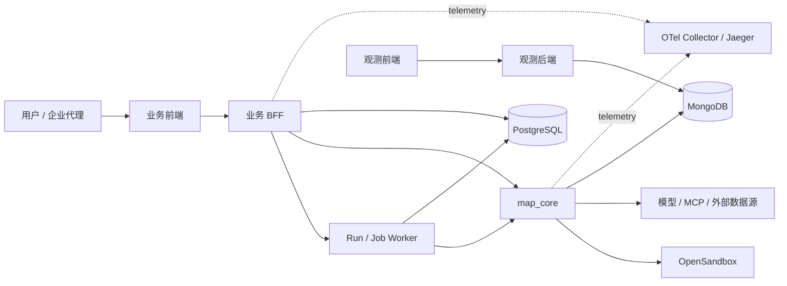
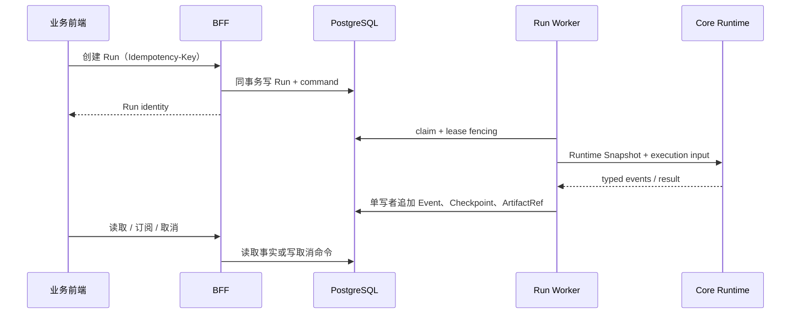

# MAP 系统设计文档（SDD）

- 文档类型：System Design Document
- 状态：Living
- 最后核对：2026-08-24
- 适用范围：本仓库的可部署系统、信任边界、数据所有权和关键运行链路

## 1. 目的与边界

MAP 是面向企业场景的多智能体应用平台。系统把用户体验、身份与控制面、持久任务、
智能体执行、沙箱执行和观测查询分成可独立演进的模块，同时要求一次 Run 能被授权、
追踪、恢复和审计。

本设计的目标是：

- 浏览器只依赖 BFF，不绕过身份、权限和数据所有权检查；
- 执行控制与算法推理解耦，失败后可判断、可恢复而不重复副作用；
- 跨模块数据与事件使用单一、版本化契约；
- 生产命令和文件执行只通过受治理的 OpenSandbox；
- 配置、执行和观测事实可以通过稳定标识关联；
- 模块拥有较小接口和较深实现，使变更尽量保持局部。

本设计不定义具体业务智能体的提示词，也不复制各 HTTP 字段、状态转移表或部署变量。
这些细节分别以 [`SPEC/contracts/`](../SPEC/contracts/) 和
[`OPERATIONS.md`](OPERATIONS.md) 为准。

## 2. 状态阅读约定

本仓库处于架构收敛期。下文严格区分：

- **当前系统**：可从源码、迁移、Compose 和测试验证的行为；
- **目标系统**：由 Accepted ADR 和权威契约确定、但可能尚未实现的行为；
- **过渡路径**：为兼容而暂时保留，禁止作为新增功能的默认落点。

状态定义见 [`docs/README.md`](README.md#状态标记)。

## 3. 系统上下文

图中 BFF 直连 Core 是**当前兼容路径**；目标执行路径是
`BFF -> durable command -> Run worker -> Core`。OpenSandbox 服务默认位于可选
Compose profile 中，未配置时受控执行能力必须 fail-closed。

## 4. 当前可部署模块

| 模块 | 代码位置 | 当前职责 | 对外入口 |
| --- | --- | --- | --- |
| 业务前端 | `map-business-frontend/` | 问答、会话实验入口、管理配置 UI | `:5174` |
| 业务 BFF | `map-business-backend/app/` | 身份、权限、会话、反馈、配置、审计、兼容代理 | `:18080` |
| Worker | `map-business-backend/app/workers/` | Job claim、lease、reconcile、受 fencing 保护的副作用 | 无公开端口 |
| Migrator | `map-business-backend/app/db/migrations/` | 以独立数据库角色执行 Alembic 迁移 | 一次性模块 |
| 算法执行 | `map_core/` | 场景选择、智能体调度、模型与工具执行、流式结果 | 开发环境 `:10000` |
| 观测后端 | `map-observability/map-observability-backend/` | Mongo 运行记录的分析与关联查询 | `:15151/api/v1` |
| 观测前端 | `map-observability/map-observability-frontend/` | 请求、智能体、工具、链路诊断 UI | `:15152` |
| OpenSandbox | 外部镜像 / `sandbox` profile | 隔离的命令、代码和文件执行 | profile 启用后 `:8080` |
| OTel / Jaeger | `otel/` / `otel` profile | 可选的 trace 接收、转发和查询 | Jaeger `:16686` |

PostgreSQL 和 MongoDB 是基础设施而非业务模块。两个前端通过
`packages/map-tree-core/` 共享问答调用树呈现能力；CORS 规则通过
`packages/cors_policy/` 在 Python 模块间复用。

## 5. 当前关键链路

### 5.1 会话与回答（已实现，过渡中）

1. 浏览器通过 BFF 创建或读取 Conversation；发送走
   `POST /api/v1/conversations/{id}/turns`（PR-F：Run-backed turn 单事务）。
2. BFF 校验 Workspace 与 Principal 所有权，在 PostgreSQL 保存消息事实。
3. Turn 创建同事务写入 user/assistant Message 与 Run/job；worker 执行 Run 并
   追加 `(run_id,seq)` 事件；浏览器只订阅 `/api/v1/runs/{id}/events`。
4. stop 走 durable `POST /api/v1/runs/{id}:cancel`；旧 `/messages/{id}:stop`
   是薄兼容适配，legacy 无 run 消息保留旧 registry/条件终态写（待 PR-G）。
5. legacy `/api/chat*` 与 message proxy 文件已停用保留，待流量取证后删除。

精确事件与幂等语义见 [`conversation.md`](../SPEC/contracts/conversation.md)
与 [`run.md`](../SPEC/contracts/run.md)（ADR-0003 message.delta）。

### 5.2 管理配置与审计（已实现，过渡中）

1. 管理写入统一进入 `RuntimeSnapshotService.apply_change`（单 PostgreSQL 事务）。
2. 模块计算前后哈希与脱敏差异，在同一事务内更新 PG 单行 AdminState。
3. 当前快照与 current pointer 由 `runtime_snapshots` / `runtime_snapshot_current` 承载。
4. 成功、失败或拒绝结果进入 append-only 审计链；不再有文件快照或 reconciler。
5. Core 通过 BFF 的运行时快照入口消费心流配置。

审计契约见 [`audit.md`](../SPEC/contracts/audit.md)。

### 5.3 Worker 与外部副作用（已实现基础）

1. Worker 从 PostgreSQL 领取 Job；每次领取增加 Attempt，并取得 lease。
2. heartbeat、完成和失败都使用 `lease_owner + attempt` fencing。
3. handler 的业务写与完成状态共用事务。
4. 外部副作用使用稳定幂等键和 Effect ledger；无法确认的结果进入 `uncertain`。
5. SIGTERM 停止新领取，并把取消信号传播给运行中的 handler。

当前 Job worker 已具备耐久调度基础，但 Canonical Run worker 尚未实现。精确语义见
[`job-outbox.md`](../SPEC/contracts/job-outbox.md)。

### 5.4 智能体执行与沙箱（过渡中）

- Core 同时保留 legacy 与 AgentScope 两种执行引擎，通过配置选择；目标是收敛为单引擎。
- 宿主 Python、shell、本地文件和 stdio MCP 执行能力已被删除或 fail-closed。
- OpenSandbox 客户端、身份校验、ledger 与崩溃恢复已有实现和测试；真实服务部署与完整集成
  仍需环境验收。
- Core 当前仍直接保存部分 Mongo 运行记录，并为沙箱 ledger 使用 PostgreSQL；目标边界要求
  Core 不直接写 Canonical Run/Event 事实。

安全决策见 [`ADR-0001`](../SPEC/adr/ADR-0001-disable-host-execution-capabilities.md)。

### 5.5 观测（已实现基础，过渡中）

- Core 把请求、智能体、工具和模型运行记录保存到 MongoDB，观测后端负责聚合查询。
- BFF 与 Core 可通过 `otel` overlay 上报 trace 到 Collector/Jaeger。
- 运行身份与 trace 身份已有传播测试，但 Canonical Event 与 OTel/Mongo 的统一投影仍属目标。

## 6. 当前数据所有权

| 事实 | 当前事实源 | 当前写入者 | 目标说明 |
| --- | --- | --- | --- |
| Workspace、Conversation、Message、Feedback | PostgreSQL `map_control` | BFF | 保持 |
| Job、Outbox、Effect、配置 Mutation、审计链 | PostgreSQL `map_control` | BFF / Worker | 由明确单写者和 fencing 约束 |
| 管理配置当前值 | `map_control.admin_state` 单行 + audit 事实 | BFF | 保持 PG 单行 + Runtime Snapshot |
| 请求、Agent、Tool、LLM 运行记录 | MongoDB | Core | 作为投影；不承担 Canonical Run 真相 |
| 沙箱调用事实 | run_events 中 effect.* 事件（PR-E）；旧 `sandbox_invocations`/`effect_ledger` 停写待排空 | RunWorker（单写者）；core 无状态 | 收敛到 Canonical Invocation/Effect 所有权 |
| Trace / Span | OTel 后端 | BFF / Core | 与 Run/Event 标识稳定关联 |

禁止通过数据库表的物理可见性推导写权限。数据所有权按模块接口和契约决定。

## 7. 目标执行模型

[`ADR-0002`](../SPEC/adr/ADR-0002-canonical-run-event-artifact-contract.md) 和
[`run.md`](../SPEC/contracts/run.md) 固定以下目标：

核心不变量：

1. `Conversation -> Run -> Step/Attempt -> Invocation/Approval/Artifact -> Event/Checkpoint`
   是唯一执行模型；
2. PostgreSQL 是 Run 生命周期的 durable truth；
3. 只有持有有效 lease 的 Run worker 写入生命周期事实；
4. BFF 只负责原子创建、读取和取消命令；
5. Core 消费不可变 Runtime Snapshot，返回 typed events/results，不直接写 Run/Event 表；
6. Event 按 `(run_id, seq)` 严格有序；大内容只通过完整性可验证的 ArtifactRef 传递。

## 8. 当前与目标差异

| 主题 | 当前 | 目标 | 状态 / 执行依据 |
| --- | --- | --- | --- |
| 用户执行入口 | `/api/chat*` 与 Conversation API 并存；PR-C 新增 `/api/v1/runs*`（未切流量） | `/api/v1/runs*` 统一 | 过渡中；代码精简计划 Step 2/4 |
| 执行所有权 | BFF 直连 Core，Message 是主要生命周期事实；PR-C/D 已具备 runs+run_events 事实集、RunWorker 生产循环与 retry/lease 收敛（未切 conversation 流量） | Run worker 单写 Canonical Event | 过渡中；ADR-0002、计划 Step 2（AC-RUN 全矩阵待 CI/E2E） |
| Agent 引擎 | legacy / AgentScope 双引擎；PR-H1 默认 AgentScope 并保留回滚开关 | AgentScope 单引擎 | 过渡中；计划 Step 5（PR-H2 待证据后删 switch） |
| 沙箱事实 | Core 自有 ledger + BFF Effect guard | Invocation/Effect 统一模型 | 过渡中；计划 Phase 2 |
| 模型调用 | 单一 typed ModelInvocation 承载全部 production caller；旧 `llm_engine.py` 壳已删除（PR-I B0–B6） | 小接口 ModelInvocation 模块（AC-03 CI/durable 对账待补） | 过渡中；计划 Step 6 |
| 配置 | PG 单行 AdminState + 不可变 Runtime Snapshot + pointer CAS；file JSON/volume/reconciler 已删除（PR-J1–J7b） | 版本化配置 + 七类资产业务语义 + generated DTO | 过渡中；计划 Step 7（AC-06/07/08 待后续资产语义） |
| 运行观测 | Mongo 记录 + OTel + SSE 语义并存 | Canonical Event 投影到观测 | 目标；计划 Phase 7 |

完整顺序、删除门槛和验收标准见
[`代码精简与可读性改造执行计划.md`](../TODO/代码精简与可读性改造执行计划.md)。

## 9. 信任与安全边界

- 浏览器身份只在 BFF 解析；Core 的 internal 入口使用服务身份，不能信任浏览器直传 Header。
- Workspace 和 Principal 所有权必须在读取、写入、订阅和取消前检查。
- 生产环境禁止 `dev` 认证模式，并要求显式可信代理配置。
- 密钥和连接串只通过环境或秘密管理注入；仓库不得提供生产可用默认凭据。
- 命令、代码和文件执行只允许 OpenSandbox；服务不可挂载宿主 Docker socket 或 kubeconfig。
- 影响外部状态的重试必须有稳定幂等键、fencing 和结果不确定态。
- 公共错误必须脱敏；内部日志、事件和 trace 也必须经过敏感数据过滤。

身份与权限细节见 [`identity.md`](../SPEC/contracts/identity.md)，安全事件与例外见
[`security/`](../security/) 和 [`SECURITY_EXCEPTIONS.md`](../SECURITY_EXCEPTIONS.md)。

## 10. 非功能约束

### 正确性与恢复

- 状态转移先验证后持久化，终态不可被迟到写覆盖。
- 所有可重试边界显式定义幂等键、超时、取消和未知结果语义。
- 数据库迁移可前滚、可验证；破坏性变更采用 expand/migrate/contract。

### 安全

- 身份、权限、服务身份和沙箱策略默认拒绝。
- 依赖与仓库凭据扫描进入 release gate；例外必须有 owner 和到期时间。

### 可观测性

- `request_id`、`workspace_id`、`conversation_id`、`run_id`、`trace_id` 在适用链路保持稳定。
- 健康探针不泄露凭据或内部错误；业务失败使用 typed error。

### 可维护性

- 每个模块以较小接口隐藏较多实现复杂度；重复策略应收敛到单一模块。
- 新增 adapter 前必须有真实第二实现、独立变化来源或测试替身需求。
- 兼容层必须有 owner、使用证据、删除条件和最晚复核点。

## 11. 架构决策与变更要求

已接受决策索引见 [`SPEC/adr/README.md`](../SPEC/adr/README.md)。涉及以下任一变化时，
必须新增或修订 ADR：

- Canonical Run 或 Event 所有权；
- 信任边界、生产执行能力或凭据策略；
- 新的持久事实源或数据迁移策略；
- 新增可部署模块或跨模块同步依赖；
- 与已接受决策不兼容的替代方案。

实现层设计、模块 seam 和迁移约束见 [`TDD.md`](TDD.md)。
